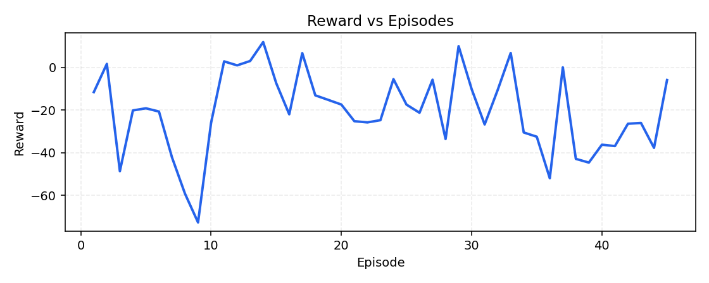
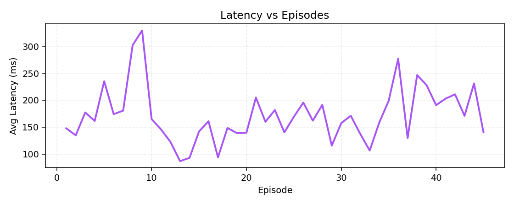

# ACRE++  
### *Multi-agent RL when cloud ops can’t pick a single “best” number*

## TL;DR (≈20 seconds)

**What:** A **multi-agent** RL environment for cloud-style ops—**RL** proposes actions; **cost** and **latency** agents can **override** you. **Delayed effects + noisy telemetry** so policies can’t cheat with perfect info.

**What improved (same eval, random → trained):** **Reward +5.56** (~**+18%** vs random magnitude) · **Latency −7.0 ms/step** · **Uptime +2.27 pts** · **Cost −2.06** — all **together**, not one metric at the expense of the others.

> **One line:** **ACRE++** proves a trained policy makes **fewer bad trade-offs per episode** when **reliability, cost, and UX** disagree—and you can **see** it in **`artifacts/`** curves + the table below.

### Quick Impact — at a glance

| | Random → trained (`incident_recovery`, 10-episode eval) |
|--|--|
| **Reward** (higher better) | **−30.66 → −25.10** (**+5.56**, ~**+18%** vs random magnitude) |
| **Avg latency** | **194.3 → 187.3 ms/step** (**−7.0 ms**) |
| **Uptime** | **42.7% → 45.0%** (**+2.27 pts**) |
| **Total cost** (lower better) | **114.48 → 112.42** (**−2.06**) |

**It’s 2 a.m.** The dashboard looks almost fine—until it doesn’t.

Traffic leans on the service, errors tick up, latency starts eating **SLIs**, and someone asks why the bill moved before anyone asked for more headroom. **Downtime** hits revenue, **cost spikes** trigger finance threads, and **slow pages** train users to leave.

That isn’t three separate incidents. **It’s one system squeezed by three masters**—and a single controller still has to pick the next move.

**ACRE++** is a compact, hackathon-ready environment that treats that tension as a first-class feature: **three agents, one system, real trade-offs**—not a toy grid with a single score to maximize.

---

## Why this stands out

- **Multi-agent conflict, on purpose** — RL, FinOps-style cost, and latency guardrails can **disagree**; **overrides** make the final action **explainable**, not hand-waved.  
- **Production-shaped pain** — delayed effects and noisy telemetry mean the policy can’t “cheat” with perfect information.  
- **Measurable learning** — same eval protocol shows **clear random → trained gains** on reward, latency, uptime, and cost in our shipped artifacts.  
- **Emergent behavior** — outcomes **aren’t scripted**; they arise from **who wins each step** when objectives collide.

---

## Quick links

| | |
|--|--|
| **Source** | [GitHub — vkl100605-design/acre](https://github.com/vkl100605-design/acre) |
| **Live demo** | [Hugging Face Space — vkl1006/acre](https://huggingface.co/spaces/vkl1006/acre) — **Streamlit UI** on `/`, **OpenEnv API** on `/health`, `/reset`, `/step`, `/state`, `/api` |
| **Re-run training** | [Open in Colab](https://colab.research.google.com/github/vkl100605-design/acre/blob/main/ACRExx_Training_Colab.ipynb) · notebook: `ACRExx_Training_Colab.ipynb` |
| **Story / blog** | [`Blog.md`](https://github.com/vkl100605-design/acre/blob/main/Blog.md) — narrative walkthrough of ACRE++ (multi-agent conflict, what we built, why it matters) |

---

## The problem (why this exists)

Cloud systems fail in **slow, messy ways**: delayed capacity effects, noisy telemetry, incidents that don’t look “binary.”

**The hard part isn’t picking an action once.** It’s living with **three pressures at once**:

- **Reliability** — stay up, recover fast.  
- **Cost** — don’t burn budget on idle headroom.  
- **User experience** — latency is revenue and trust.

**Those goals conflict.** Optimizing one in isolation is how you get surprises in production. **ACRE++** is built so a learner—and anyone reading the traces—can *see* that conflict instead of pretending it away.

---

## A real-world slice (scenario)

Imagine **incident recovery** right after a rough deploy: traffic isn’t polite, health wobbles, and latency jumps **before** the cost line tells the full story. In that moment, three instincts show up at once:

- The **learner** wants to act on value—**scale, hold, or recover** based on what it has seen.  
- **Cost** says: don’t pay for air; don’t scale into waste when demand doesn’t justify it.  
- **Latency** says: if users are feeling slowness, **UX wins the argument**—even if that clashes with “cheapest right now.”

**That’s the conflict:** not villains—**competing responsibilities**—and the environment makes the collision **explicit**.

**Before training**, the RL side behaves closer to **random probing**: you see **more oscillation**, **worse reward**, **higher average latency**, and **weaker uptime** under the *same* rules as later. It isn’t “broken code”—it’s **untrained policy in a hard room**.

**After training**, the policy **learns to balance** the stack: it **earns higher reward**, **cuts average latency per step in evaluation**, **lifts uptime**, and **reduces cost vs the random baseline**—without deleting overrides. The service doesn’t become fairy-tale stable; decisions feel **more stable and purposeful** because the learner **stopped thrashing** and started **negotiating** the trade-offs it will always face in production.

That **before → after** contrast—under identical eval—is what we ship as proof, not a single cherry-picked metric.

---

## What we built (environment innovation)

**ACRE++** is a **multi-agent RL environment** over a single simulated service:

| Layer | Role |
|--------|------|
| **Environment** | Traffic, health, errors, **latency (ms)**, **step cost**, capacity, risk—**delayed effects** and noisy signals so decisions aren’t “free information.” |
| **RL agent** | Tabular **Q-learning** (`rl_agent.py`)—learns long-horizon action values. |
| **Cost agent** | **Rule-based FinOps** guardrails (`cost_agent.py`). |
| **Latency agent** | **UX guardrail** that escalates when latency is too high (`latency_agent.py`). |

**Actions (operator-style):** `hold`, `scale_up`, `scale_down`, `restart`, `rollback`.

**Reward** blends uptime/recovery signals with penalties for overload, waste, cost, errors, and latency—so “winning” means **balancing**, not maxing one dial.

> **Emergent behavior:** when agents disagree, **overrides** fire. The final action may not be what the learner wanted—**that’s realistic** and **inspectable** in traces and UI.

**Tasks** (see `tasks.py`, `openenv.yaml`): `stability_spike`, `incident_recovery`, `budget_guardrail`.

## 🧪 What’s Novel Here

- **Not single-objective RL** → **true multi-objective conflict** (uptime / cost / latency all matter in the reward).  
- **Not a static MDP** → **delayed + noisy signals** so the policy can’t see the future for free.  
- **Not one agent** → **multi-agent override system** (RL proposal vs cost vs latency guardrails—**final action may differ**).  
- **Not scripted outcomes** → **emergent behavior** from **who wins each step** when responsibilities collide.

---

## Training & evidence (Q-learning is the proof)

**What we ship as learning evidence:** tabular **Q-learning** in **`train_clean.py`** — explicit `reset → step` loop with cost + latency suggestions each step, per-episode reward/latency/cost logs, **`artifacts/q_table_clean.json`**, learning curves, and **`artifacts/training_clean_summary.json`**. The **random vs trained** table and PNG curves in this README come from that run—not from an LLM trainer.

**Learning signal:** episode curves show reward climbing from early noise toward **more consistent, less random behavior**—the agent is **not** drawing actions from a hat anymore; it is **fitting a policy under conflict**, which is exactly what production-style RL must prove here.

**Core artifacts (included / regenerable with `train_clean.py`):**

- `artifacts/reward_curve.png` · `artifacts/latency_curve.png`  
- `artifacts/training_clean_summary.json` · `artifacts/q_table_clean.json`

**Optional / future work — LLM + TRL-shaped hooks (not the main result):**  
`train_llm.py` can run a small **LLM + PPO** experiment on the same env (heavy deps: `torch`, `trl`, … in `requirements.txt`; the HF Space image uses **`requirements_space.txt`** — no torch — for a fast public demo).  
`trl_unsloth_bridge.py` can emit a **sample** `artifacts/trl_interactions.jsonl` (**state_text → action → reward** rows) and `artifacts/trl_compat_report.json` for **downstream** TRL-style or Unsloth-style pipelines—that is a **compatibility / integration stub**, not a second trained policy we claim beside Q-learning. Use it when you want to wire external trainers; **do not** read it as “we proved LLM RL in the box.”

---

## Results (random vs trained — same eval protocol)

**Same environment, same agents, same overrides—only the tabular Q policy changed.** Post-training **10-episode** evaluation on **`incident_recovery`** (source: `artifacts/training_clean_summary.json`).

| Metric | Random baseline | Trained policy | What moved |
|--------|-----------------|----------------|------------|
| **Episode reward** (higher is better) | **-30.66** | **-25.10** | **+5.56** (~**+18%** vs random magnitude) |
| **Total cost** (lower is better) | 114.48 | 112.42 | **-2.06** |
| **Uptime %** | 42.7% | **45.0%** | **+2.27 pts** |
| **Avg latency (ms / step)** | 194.3 | **187.3** | **-7.0 ms** |

**Bottom line:** the trained policy makes **fewer bad trade-offs per episode**—improving **reward, latency, uptime, and cost** at once, not by maxing one metric and hiding the rest.

### What this means (read the numbers once, remember the story)

**Only the RL policy changed.** Random control is **“untrained autopilot”**: it **oscillates**, burns **latency and uptime**, and leaves **money on the table**.

The trained policy **learned to balance** those pressures: **higher reward** ⇒ fewer bad tradeoffs per episode · **lower latency** ⇒ fewer user-visible regrets per step · **higher uptime** ⇒ fewer minutes in the red · **lower cost** ⇒ FinOps breathes easier—all **simultaneously** in this eval, not by hiding two goals to max the third.

**Three takeaways**

1. **Reward isn’t noise anymore** — the gap (**+5.56**, ~**+18%** vs random magnitude) is **visible learning**, not a lucky seed: the policy **recovers** under the **same** multi-agent friction.  
2. **Latency and uptime move the right way together** — the learner **reduced average step latency** while **lifting uptime**; that’s **more stable decision-making** under pressure, not a single-metric hack.  
3. **Overrides still fire** — we don’t “solve” conflict by deleting it; we **earn calmer behavior** *while* guardrails still matter—**exactly** the production story.

---

## 📈 Visual Proof of Learning

**Proof is embedded below**—no hunting in the file tree. Learning shows up in **seconds**: trend lines and calmer tails, not a paragraph of claims.





### Quick visual checklist (~10 seconds)

1. **Reward (plot above):** reward vs episode—**upward trend** after early noise; less “random walk” late in training.  
2. **Latency (plot above):** avg latency per episode—**fewer spikes**, **calmer tail** as thrashing drops.  
3. Optional: run Streamlit / Space UI → **decision box + timeline** show **overrides** and **less oscillatory** scaling as training completes.

**Reproduce:** `python train_clean.py --task-id incident_recovery --episodes 80 --seed 42` → fresh PNGs + `artifacts/training_clean_summary.json`.

---

## OpenEnv API (submission runtime)

**ACRE++** exposes a **fully compatible OpenEnv-style HTTP interface** (`openenv_server.py`, `openenv.yaml`):

- `POST /reset` · `POST /step` · `GET /state` · `GET /health` · `GET /api` (metadata JSON)

**Local API:**

```bash
uvicorn openenv_server:app --host 0.0.0.0 --port 8000
```

**Hugging Face Space:** nginx on **7860** routes **/** → **Streamlit** (`app.py`), API paths → **FastAPI** (see `Dockerfile`, `space/entrypoint.sh`, `space/nginx.conf`).

**Docker (matches Space):**

```bash
docker build -t acrepp .
docker run -p 7860:7860 acrepp
```

**Validate locally:** `python validate_submission.py`  
**Pre-submit sanity (Q-learning artifacts, API, smoke episodes; optional bridge export):** `python submission_final_check.py`

---

## Streamlit demo (storytelling UI)

```bash
streamlit run app.py
```

### 🎬 Try this first (demo flow—2 minutes)

1. **Open** the Streamlit app (local command above, or the **HF Space** → root `/` UI).  
2. In the sidebar, click **“Train Incident Recovery”** (task: `incident_recovery`) once—or **“Run 30s Demo”** for the full scripted flow.  
3. **Watch** the **learning curves** and **metrics** update—early **instability**, visible **agent conflicts / overrides** in the **decision box** and timeline, then **clearer stabilization** as training completes.  
4. Optional next clicks: **“Run Incident Demo”** (latency pressure / overrides) → **“Run Budget Failure Demo”** (cost vs reliability stress).

**Scenarios baked in:** balanced learning, **latency override** arc, **budget / cost failure** arc—timeline, decision box, and charts use the **same** `ACREEnv` as training.

---

## Reproduce (minimal commands)

**Primary (matches README evidence):**

```bash
pip install -r requirements.txt
python train_clean.py --task-id incident_recovery --episodes 80 --seed 42
```

**Optional — bridge sample for external TRL-style tooling (not required for the Q-learning claim):**

```bash
python trl_unsloth_bridge.py
```

**Optional — LLM + PPO on the same env (separate experiment; heavy deps):**

```bash
python train_llm.py --episodes 4 --task-id incident_recovery --model-name Qwen/Qwen2.5-0.5B-Instruct --seed 42
python plot_submission_artifacts.py   # after LLM runs: plots from llm_training_log.jsonl
```

---

## Why this matters (impact)

Every **autoscaler**, **SRE playbook**, and **FinOps guardrail** eventually answers the same question: **who absorbs the pain when two good goals collide?** Train on one scalar and you get a model that is “optimal” on paper and **surprising** in production—because **downtime, invoices, and churn** were always in the room.

**ACRE++** keeps all three on stage: **SRE** (uptime / recovery), **FinOps** (cost discipline), **product reality** (latency → users). RL here isn’t “guess a magic weight”—it’s **learned balancing** with **measurable lift** over random control **and** explicit override stories you can **audit** like an incident timeline.

**If your RL can’t survive this room, it won’t survive the pager—ACRE++ is the room.**

---

## Key files (map)

| Area | Files |
|------|--------|
| Narrative | [`Blog.md`](Blog.md) — long-form project story (companion to this README) |
| Env | `env.py`, `tasks.py`, `reward.py` |
| Agents | `rl_agent.py`, `cost_agent.py`, `latency_agent.py` |
| Training / eval | `train_clean.py`, `train.py`, `evaluation.py` |
| OpenEnv | `openenv_adapter.py`, `openenv_server.py`, `openenv.yaml` |
| UI | `app.py`, `plotting.py` |
| LLM | `llm_agent.py`, `parser.py`, `trl_training.py`, `train_llm.py` |
| Bridge / checks | `trl_unsloth_bridge.py` (optional TRL-shaped export), `validate_submission.py`, `submission_final_check.py` |

`requirements.txt` — full stack · `requirements_space.txt` — Space image only.

---

**ACRE++** demonstrates how **multi-agent systems** and **realistic constraints** produce **rich, emergent behavior**—and how **measured training** can still **improve outcomes** when there is no single “right” number to optimize. **That’s the bar real autoscaling has to clear—and now you can train and evaluate against it in the open.**
